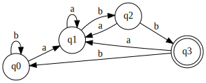

# Converting a Regular Expression Directly to a DFA

This is an optimization that can be used when generating a [DFA](https://en.wikipedia.org/wiki/Deterministic_finite_automaton) from a regular expression to avoid creating an intermediate [NFA](https://en.wikipedia.org/wiki/Nondeterministic_finite_automaton) and generate a non-minimized DFA directly from the regular expression string.

The implemented algorithms described in the book "Compilers: Principles, Techniques, and Tools" in the following sections:

3.9.3 Computing `nullable`, `firstpos`, and `lastpos`
3.9.4 Computing `followpos`
3.9.5 Converting a Regular Expression Directly to a DFA

## Building

```
git clone https://github.com/ghallak/regex-to-dfa.git
cd regex-to-dfa
make build
```

## Running

```
./regex-to-dfa
```

## Example

In the file [Main.cpp](src/Main.cpp), create a DFA from the regular expression `
(a|b)*abb`:

```
#include "DFA.h"
#include "RegexTree.h"

int main() {
  auto tree = RegexTree("(a|b)*abb");
  auto dfa = DFA(tree);
  dfa.CreateDotFile("example.gv");
}
```

This will create the dot file `example.gv`. An svg can be generated from this file by running:

```
dot -Tsvg example.gv -o example.svg
```

The following svg will be generated for the above example:


